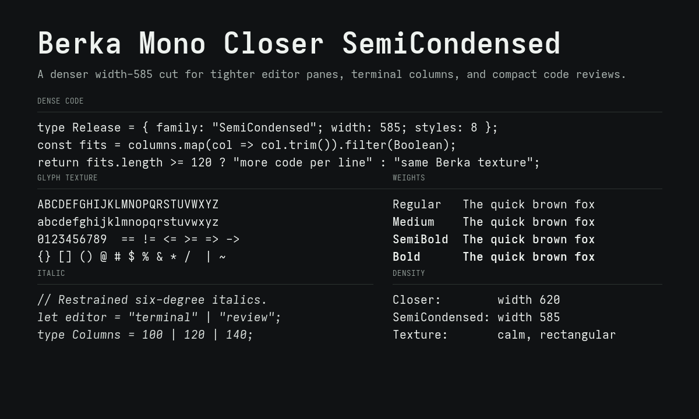
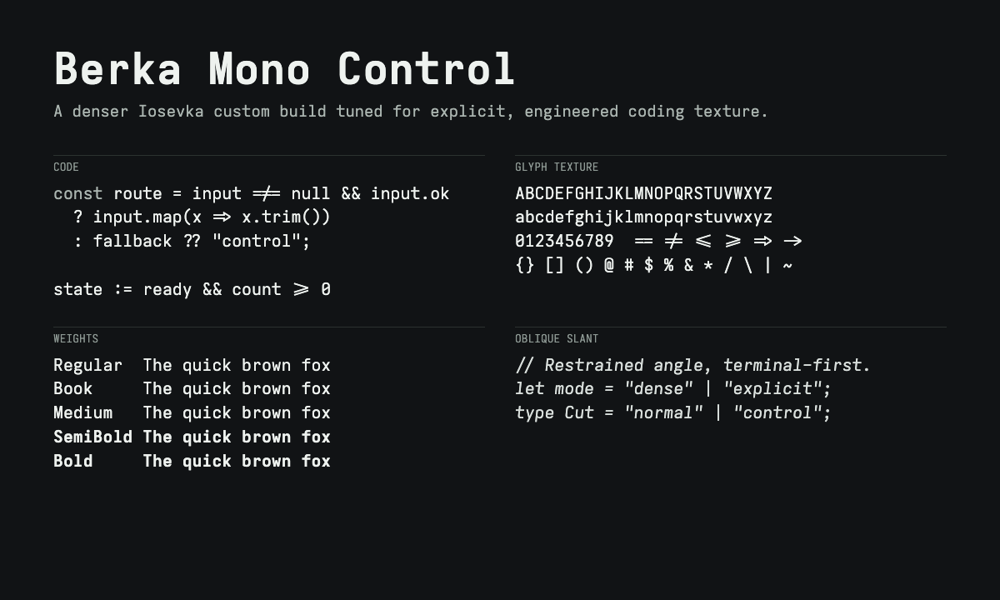
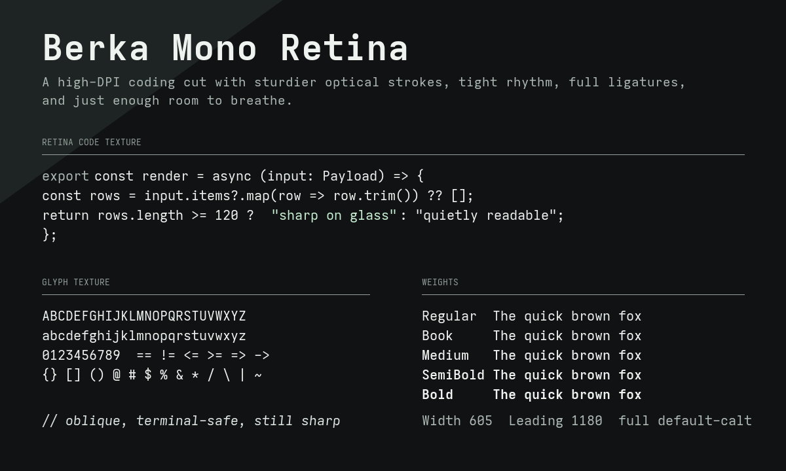

# Berka Mono Closer

Berka Mono Closer is a custom build of [Iosevka](https://github.com/be5invis/Iosevka) tuned for a calm, wide, rectangular coding-font feel.

The repository includes five families:

- `Berka Mono Closer`: the original wider cut.
- `Berka Mono Closer Compact`: the same glyph design, ligatures, leading, and italic angle, with a slightly narrower width for a more focused coding texture.
- `Berka Mono Closer SemiCondensed`: a denser cut at width 585 for tighter terminal and editor columns.
- `Berka Mono Control`: the densest experiment, tuned from the TX-02 datasheet's broad functional brief while staying legally distinct: narrower spacing, tighter leading, oblique-style slants, a Book weight, and fuller Iosevka ligature coverage.
- `Berka Mono Retina`: a high-DPI coding cut with slightly heavier optical strokes, a little more breathing room than Control, tight leading, oblique-style slants, a Book weight, and full programming ligatures.

It is built only from Iosevka's open source build system and variant parameters. It does not contain proprietary outlines, copied glyphs, or commercial font files.








## Download

Install the TTF files from:

```text
fonts/ttf/
fonts/ttf-compact/
fonts/ttf-semi-condensed/
fonts/ttf-control/
fonts/ttf-retina/
```

Use the WOFF2 files for websites:

```text
fonts/woff2/
fonts/woff2-compact/
fonts/woff2-semi-condensed/
fonts/woff2-control/
fonts/woff2-retina/
```

On macOS, you can copy them into `~/Library/Fonts`:

```sh
./scripts/install-macos.sh
```

Use this font family name in editors and terminals:

```text
Berka Mono Closer
Berka Mono Closer Compact
Berka Mono Closer SemiCondensed
Berka Mono Control
Berka Mono Retina
```

## VS Code

After installing the TTF files, open `settings.json` with `Preferences: Open User Settings (JSON)` and add:

```json
{
  "editor.fontFamily": "'Berka Mono Closer', monospace",
  "editor.fontLigatures": true,
  "terminal.integrated.fontFamily": "'Berka Mono Closer'"
}
```

For Compact, SemiCondensed, Control, or Retina, replace `Berka Mono Closer` with the matching family name from the Download section.

## Cursor

Cursor uses VS Code-compatible settings. After installing the TTF files, open `settings.json` with `Preferences: Open User Settings (JSON)` and add:

```json
{
  "editor.fontFamily": "'Berka Mono Closer', monospace",
  "editor.fontLigatures": true,
  "terminal.integrated.fontFamily": "'Berka Mono Closer'"
}
```

You can also import existing VS Code settings from Cursor Settings if you already configured the font in VS Code.

## Zed

After installing the TTF files, open Zed settings and add:

```json
{
  "buffer_font_family": "Berka Mono Closer",
  "buffer_font_features": {
    "calt": true,
    "liga": true
  },
  "terminal": {
    "font_family": "Berka Mono Closer"
  }
}
```

For Compact, SemiCondensed, Control, or Retina, replace `Berka Mono Closer` with the matching family name from the Download section.

## Styles

- Regular
- Italic
- Medium
- Medium Italic
- SemiBold
- SemiBold Italic
- Bold
- Bold Italic

`Berka Mono Control` and `Berka Mono Retina` also include Book and Book Italic.

## Ligatures

Programming ligatures are enabled through Iosevka's `default-calt` set.

Closer, Compact, and SemiCondensed intentionally disable a few more decorative groups:

- `arrow-wave`
- `counter-arrow-wave`
- `html-comment`
- `trig`

Control and Retina keep the full `default-calt` set for broader language and markup coverage.

## Ghostty

```conf
font-family = "Berka Mono Closer"
font-family-bold = "Berka Mono Closer"
font-family-italic = "Berka Mono Closer"
font-family-bold-italic = "Berka Mono Closer"
font-size = 15
font-feature = liga
font-feature = calt
font-feature = clig
font-thicken = true
```

Full example: [examples/ghostty.conf](examples/ghostty.conf)

For Compact, replace the family name with:

```conf
font-family = "Berka Mono Closer Compact"
font-family-bold = "Berka Mono Closer Compact"
font-family-italic = "Berka Mono Closer Compact"
font-family-bold-italic = "Berka Mono Closer Compact"
```

For SemiCondensed, replace the family name with:

```conf
font-family = "Berka Mono Closer SemiCondensed"
font-family-bold = "Berka Mono Closer SemiCondensed"
font-family-italic = "Berka Mono Closer SemiCondensed"
font-family-bold-italic = "Berka Mono Closer SemiCondensed"
```

For Control, replace the family name with:

```conf
font-family = "Berka Mono Control"
font-family-bold = "Berka Mono Control"
font-family-italic = "Berka Mono Control"
font-family-bold-italic = "Berka Mono Control"
```

For Retina, replace the family name with:

```conf
font-family = "Berka Mono Retina"
font-family-bold = "Berka Mono Retina"
font-family-italic = "Berka Mono Retina"
font-family-bold-italic = "Berka Mono Retina"
```

## Kitty

```conf
font_family      family="Berka Mono Closer"
bold_font        family="Berka Mono Closer" style="Bold"
italic_font      family="Berka Mono Closer" style="Italic"
bold_italic_font family="Berka Mono Closer" style="Bold Italic"
font_size        15.0
disable_ligatures never
```

Full example: [examples/kitty.conf](examples/kitty.conf)

For Compact, replace the family name with:

```conf
font_family      family="Berka Mono Closer Compact"
bold_font        family="Berka Mono Closer Compact" style="Bold"
italic_font      family="Berka Mono Closer Compact" style="Italic"
bold_italic_font family="Berka Mono Closer Compact" style="Bold Italic"
```

For SemiCondensed, replace the family name with:

```conf
font_family      family="Berka Mono Closer SemiCondensed"
bold_font        family="Berka Mono Closer SemiCondensed" style="Bold"
italic_font      family="Berka Mono Closer SemiCondensed" style="Italic"
bold_italic_font family="Berka Mono Closer SemiCondensed" style="Bold Italic"
```

For Control, replace the family name with:

```conf
font_family      family="Berka Mono Control"
bold_font        family="Berka Mono Control" style="Bold"
italic_font      family="Berka Mono Control" style="Italic"
bold_italic_font family="Berka Mono Control" style="Bold Italic"
```

For Retina, replace the family name with:

```conf
font_family      family="Berka Mono Retina"
bold_font        family="Berka Mono Retina" style="Bold"
italic_font      family="Berka Mono Retina" style="Italic"
bold_italic_font family="Berka Mono Retina" style="Bold Italic"
```

## Build From Source

Requirements:

- Node.js 16 or newer
- npm
- `ttfautohint`
- Python 3 with `fonttools` for WOFF2 generation
- git

On macOS:

```sh
brew install ttfautohint
```

Build:

```sh
git clone --depth 1 https://github.com/be5invis/Iosevka.git
cd Iosevka
cp /path/to/berka-mono-closer/sources/private-build-plans.toml ./private-build-plans.toml
npm install
npm run build -- ttf::BerkaMonoCloser --jCmd=2
npm run build -- ttf::BerkaMonoCloserCompact --jCmd=2
npm run build -- ttf::BerkaMonoCloserSemiCondensed --jCmd=2
npm run build -- ttf::BerkaMonoControl --jCmd=2
npm run build -- ttf::BerkaMonoRetina --jCmd=2
```

The generated files will be in:

```text
dist/BerkaMonoCloser/TTF/
dist/BerkaMonoCloserCompact/TTF/
dist/BerkaMonoCloserSemiCondensed/TTF/
dist/BerkaMonoControl/TTF/
dist/BerkaMonoRetina/TTF/
```

You can also run:

```sh
./scripts/build.sh /path/to/Iosevka
```

The script copies each family-specific build plan before building that family, including `sources/retina/private-build-plans.toml` for `Berka Mono Retina`.

Generate WOFF2 files from the checked-in TTF files:

```sh
./scripts/build-woff2.sh
```

## Legal Notes

Berka Mono Closer is a modified build of Iosevka and is distributed under the SIL Open Font License 1.1, matching Iosevka's license.

What makes this legal:

- The source is Iosevka, an OFL-licensed font project.
- The font is generated from Iosevka's documented custom build configuration.
- The name is changed to `Berka Mono Closer`, so it does not use Iosevka's reserved font name as the primary family name.
- No commercial font software, outlines, metrics files, or binaries are included.
- The design goal is a general visual direction: calm, wide, rectangular, readable coding text. It is not a clone of any proprietary font.
- The Control variant is guided by public high-level design language from a datasheet, but it is generated only from Iosevka source and documented custom-build parameters.

This project is not affiliated with, endorsed by, or derived from Berkeley Mono or US Graphics Company. Berkeley Mono is a separate commercial font.

## License

Licensed under the SIL Open Font License 1.1. See [LICENSE](LICENSE).
