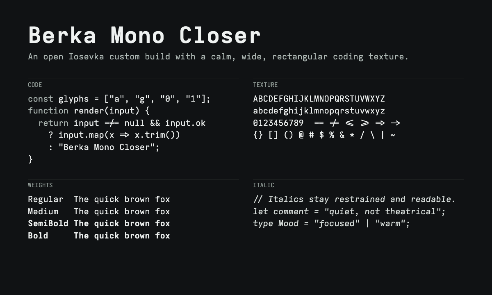
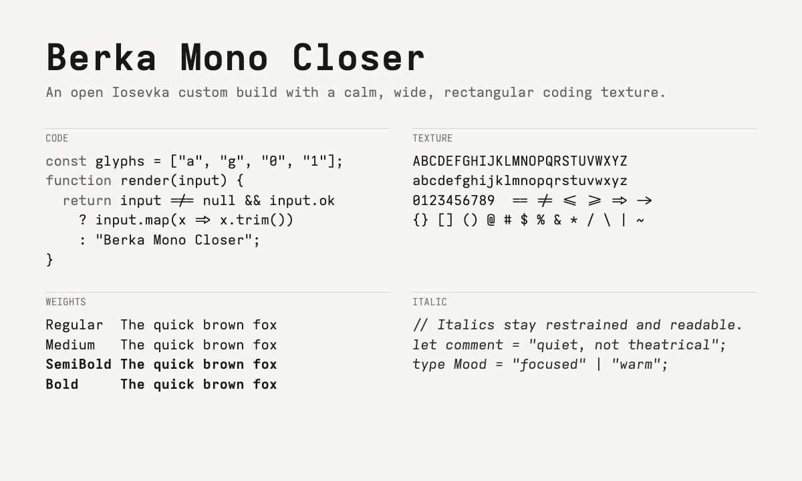
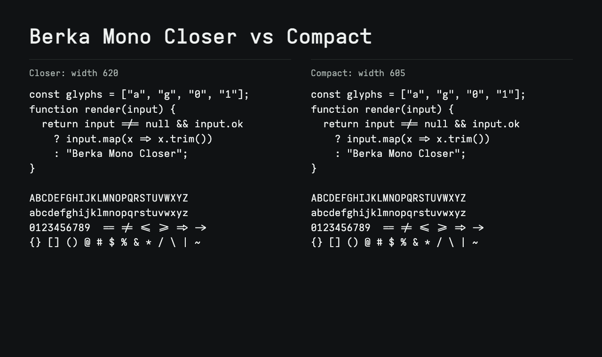

# Berka Mono Closer

Berka Mono Closer is a custom build of [Iosevka](https://github.com/be5invis/Iosevka) tuned for a calm, wide, rectangular coding-font feel.

The repository includes two families:

- `Berka Mono Closer`: the original wider cut.
- `Berka Mono Closer Compact`: the same glyph design, ligatures, leading, and italic angle, with a slightly narrower width for a more focused coding texture.

It is built only from Iosevka's open source build system and variant parameters. It does not contain proprietary outlines, copied glyphs, or commercial font files.







## Download

Install the TTF files from:

```text
fonts/ttf/
fonts/ttf-compact/
```

On macOS, you can copy them into `~/Library/Fonts`:

```sh
./scripts/install-macos.sh
```

Use this font family name in editors and terminals:

```text
Berka Mono Closer
Berka Mono Closer Compact
```

## Styles

- Regular
- Italic
- Medium
- Medium Italic
- SemiBold
- SemiBold Italic
- Bold
- Bold Italic

## Ligatures

Programming ligatures are enabled through Iosevka's `default-calt` set.

The build intentionally disables a few more decorative groups:

- `arrow-wave`
- `counter-arrow-wave`
- `html-comment`
- `trig`

## Ghostty

```conf
font-family = "Berka Mono Closer"
font-family-bold = "Berka Mono Closer"
font-family-italic = "Berka Mono Closer"
font-family-bold-italic = "Berka Mono Closer"
font-size = 15
font-feature = liga
font-feature = calt
font-feature = clig
font-thicken = true
```

Full example: [examples/ghostty.conf](examples/ghostty.conf)

For Compact, replace the family name with:

```conf
font-family = "Berka Mono Closer Compact"
font-family-bold = "Berka Mono Closer Compact"
font-family-italic = "Berka Mono Closer Compact"
font-family-bold-italic = "Berka Mono Closer Compact"
```

## Kitty

```conf
font_family      family="Berka Mono Closer"
bold_font        family="Berka Mono Closer" style="Bold"
italic_font      family="Berka Mono Closer" style="Italic"
bold_italic_font family="Berka Mono Closer" style="Bold Italic"
font_size        15.0
disable_ligatures never
```

Full example: [examples/kitty.conf](examples/kitty.conf)

For Compact, replace the family name with:

```conf
font_family      family="Berka Mono Closer Compact"
bold_font        family="Berka Mono Closer Compact" style="Bold"
italic_font      family="Berka Mono Closer Compact" style="Italic"
bold_italic_font family="Berka Mono Closer Compact" style="Bold Italic"
```

## Build From Source

Requirements:

- Node.js 16 or newer
- npm
- `ttfautohint`
- git

On macOS:

```sh
brew install ttfautohint
```

Build:

```sh
git clone --depth 1 https://github.com/be5invis/Iosevka.git
cd Iosevka
cp /path/to/berka-mono-closer/sources/private-build-plans.toml ./private-build-plans.toml
npm install
npm run build -- ttf::BerkaMonoCloser --jCmd=2
npm run build -- ttf::BerkaMonoCloserCompact --jCmd=2
```

The generated files will be in:

```text
dist/BerkaMonoCloser/TTF/
dist/BerkaMonoCloserCompact/TTF/
```

You can also run:

```sh
./scripts/build.sh /path/to/Iosevka
```

## Legal Notes

Berka Mono Closer is a modified build of Iosevka and is distributed under the SIL Open Font License 1.1, matching Iosevka's license.

What makes this legal:

- The source is Iosevka, an OFL-licensed font project.
- The font is generated from Iosevka's documented custom build configuration.
- The name is changed to `Berka Mono Closer`, so it does not use Iosevka's reserved font name as the primary family name.
- No commercial font software, outlines, metrics files, or binaries are included.
- The design goal is a general visual direction: calm, wide, rectangular, readable coding text. It is not a clone of any proprietary font.

This project is not affiliated with, endorsed by, or derived from Berkeley Mono or US Graphics Company. Berkeley Mono is a separate commercial font.

## License

Licensed under the SIL Open Font License 1.1. See [LICENSE](LICENSE).
