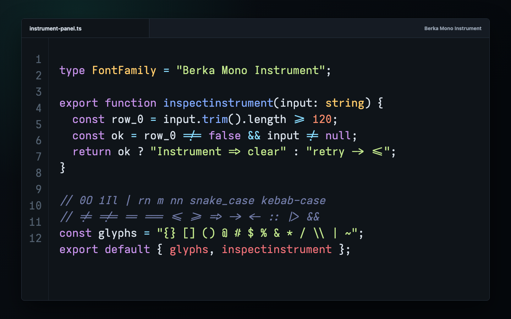
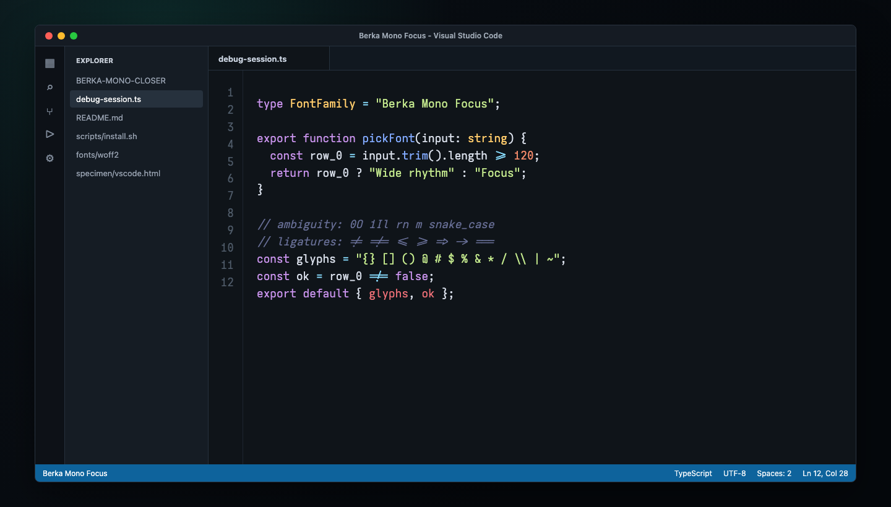
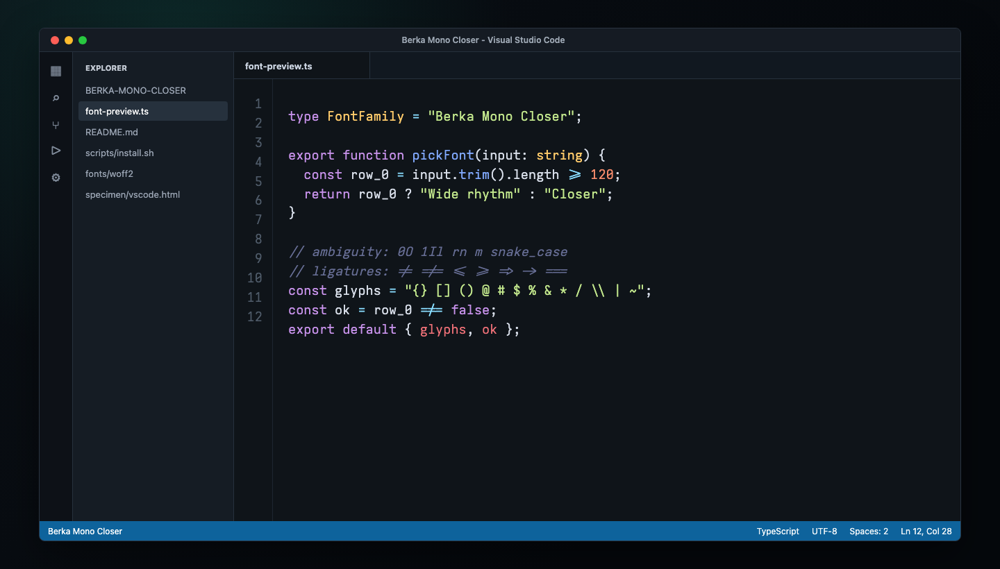
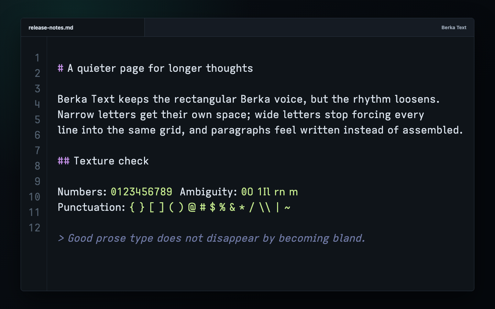

# Berka Mono Closer

Berka Mono Closer is a family of custom [Iosevka](https://github.com/be5invis/Iosevka) builds tuned for calm, rectangular, readable coding text.

## Install

Recommended everyday setup:

```sh
curl -fsSL https://raw.githubusercontent.com/vinitkumar/berka-mono-closer/main/scripts/install.sh | sh -s -- instrument
```

Interactive setup:

```sh
curl -fsSL https://raw.githubusercontent.com/vinitkumar/berka-mono-closer/main/scripts/install.sh | sh
```

The installer downloads and installs only the family you select, then prints
editor and terminal setup snippets for that family. It does not rewrite editor,
IDE, or terminal config files.

Per-user install locations:

```text
macOS:   ~/Library/Fonts
Linux:   ${XDG_DATA_HOME:-~/.local/share}/fonts
Windows: %LOCALAPPDATA%\Microsoft\Windows\Fonts plus HKCU font registration
```

Printed setup guidance covers:

```text
VS Code, Cursor, Windsurf, JetBrains IDEs, Zed, Ghostty, Kitty, Alacritty,
WezTerm, Windows Terminal, Neovim GUI, Neovide, Vim GUI, and CSS.
```

## Pick A Family

| Choice | Family name | Best for |
| --- | --- | --- |
| `instrument` | `Berka Mono Instrument` | Recommended default. Instrument-panel coding feel, expanded audited ligatures, compact scan density, explicit ambiguity handling. |
| `closer` | `Berka Mono Closer` | Wider, calm original cut. |
| `focus` | `Berka Mono Focus` | Debugging-first, clearer ambiguity cases, compact rhythm. |
| `text` | `Berka Text` | Blog prose and long-form reading, with quasi-proportional spacing. |

Install a different family by changing the final argument:

```sh
curl -fsSL https://raw.githubusercontent.com/vinitkumar/berka-mono-closer/main/scripts/install.sh | sh -s -- focus
```

Try the fonts in the browser: <https://vinitkumar.github.io/berka-mono-closer/>

## Manual Setup

Download the latest release: <https://github.com/vinitkumar/berka-mono-closer/releases/latest>

Install the TTF files from:

```text
fonts/ttf/
fonts/ttf-focus/
fonts/ttf-instrument/
fonts/ttf-text/
```

Use the WOFF2 files for websites:

```text
fonts/woff2/
fonts/woff2-focus/
fonts/woff2-instrument/
fonts/woff2-text/
```

From a repo checkout, install one family without downloading:

```sh
./scripts/install.sh --source-dir . focus
```

Use one of these family names in editors and terminals:

```text
Berka Mono Closer
Berka Mono Focus
Berka Mono Instrument
Berka Text
```

## Editor Setup

VS Code, Cursor, and Windsurf:

```json
{
  "editor.fontFamily": "'Berka Mono Instrument', 'Berka Mono Focus', Menlo, Monaco, monospace",
  "editor.fontLigatures": true,
  "terminal.integrated.fontFamily": "Berka Mono Instrument"
}
```

Zed:

```json
{
  "buffer_font_family": "Berka Mono Instrument",
  "buffer_font_features": {
    "calt": true,
    "liga": true
  },
  "terminal": {
    "font_family": "Berka Mono Instrument"
  }
}
```

Ghostty:

```conf
font-family = "Berka Mono Instrument"
font-family-bold = "Berka Mono Instrument"
font-family-italic = "Berka Mono Instrument"
font-family-bold-italic = "Berka Mono Instrument"
font-size = 15
font-feature = liga
font-feature = calt
font-feature = clig
font-thicken = true
```

Kitty:

```conf
font_family      family="Berka Mono Instrument"
bold_font        family="Berka Mono Instrument" style="Bold"
italic_font      family="Berka Mono Instrument" style="Italic"
bold_italic_font family="Berka Mono Instrument" style="Bold Italic"
font_size        15.0
disable_ligatures never
```

For another family, replace `Berka Mono Focus` with the matching family name
from the table above. Full terminal examples are in:

```text
examples/ghostty.conf
examples/kitty.conf
```

macOS Terminal.app does not use a dotfile-style font config. Use the profile
settings UI instead:

```text
Terminal -> Settings -> Profiles -> Text -> Font
```

See [Mac Terminal setup](docs/macos-terminal.md) for screenshots and steps.

## Website Fonts

Use WOFF2 files for websites. Example:

```css
@font-face {
  font-family: "Berka Text";
  src: url("fonts/woff2-text/BerkaText-Regular.woff2") format("woff2");
  font-weight: 400;
  font-style: normal;
  font-display: swap;
}
```

`Berka Text` is the recommended website body family. Pair it with `Berka Mono
Instrument`, `Berka Mono Focus`, or `Berka Mono Closer` for inline code and code blocks:

```css
body {
  font-family: "Berka Text", system-ui, sans-serif;
  font-size: 18px;
  line-height: 1.6;
}

code,
pre {
  font-family: "Berka Mono Instrument", ui-monospace, monospace;
}
```

## Families

The families share the same core upright glyph design. The real differences are
width, weight, leading, italic construction, and ligature policy:

| Family | Cell width | Weights | Leading | Italic | Ligature policy |
| --- | ---: | --- | ---: | --- | --- |
| `Berka Mono Closer` | 620 | 400, 500, 600, 700 | 1200 | italic | disables `arrow-wave`, `counter-arrow-wave`, `html-comment`, `trig` |
| `Berka Mono Focus` | 592 | 425, 465, 525, 620, 710 | 1170 | oblique | debugging-first `default-calt` subset |
| `Berka Mono Instrument` | 590 | 420, 460, 520, 615, 705 | 1165 | oblique | expanded audited `calt` |
| `Berka Text` | 600 | 410, 455, 520, 610, 690 | 1260 | italic | no programming ligatures |

All families include Regular, Italic, Medium, Medium Italic, SemiBold,
SemiBold Italic, Bold, and Bold Italic. Focus, Instrument, and Text also include
Book and Book Italic.

All four official families use a bent `7` with a short upright stem for clearer
numerals in timestamps, counters, and tabular data.

They also use an open fourfold `@`. Its outer bowl, inner counter, and exit
stroke remain distinct at terminal size, making addresses and decorators easier
to recognize.

Instrument is the recommended everyday coding cut. It is a legally distinct
Iosevka build tuned after studying the TX-02 datasheet as design research:
instrument-panel density, expanded audited programming ligatures, high-DPI
stroke weight, a long-dotted zero, a baseless `1`, a high underscore for
`snake_case`, compact punctuation, a clear open `@`, and explicit ambiguous
glyphs. It does not copy TX-02 outlines, metrics, font data, or protected names.

Focus is the debugging-first cut. It keeps useful operator
ligatures but disables decorative wave arrows, HTML comment ligatures, trig
ligatures, and tilde chaining so raw source stays easy to inspect. It also uses
a long-dotted zero, a baseless `1`, a high underscore for `snake_case`, larger
parentheses, and curly-flat braces for nested code.

Text is the prose cut. It keeps the Berka rectangular voice, but switches to
quasi-proportional spacing, taller leading, true italic emphasis, the shared
long-dotted zero, smoother punctuation, and no programming ligatures so paragraphs feel
like essays instead of source code.

## Ligatures

Programming ligatures are enabled through Iosevka's `default-calt` set.

Closer intentionally disables a few more decorative groups:

- `arrow-wave`
- `counter-arrow-wave`
- `html-comment`
- `trig`

Instrument starts from `default-calt` and adds existing
Iosevka groups for counter arrows, fast operator chains, slash equality,
logic, bracket bars, and operator centering.

The `brace-bar` group is intentionally excluded. Keeping `{|` and `|}` as
separate monospace glyphs prevents the bar from visually collapsing into the
curly brace at Instrument's compact cell width.

Instrument was audited against a TX-02-datasheet-inspired programming sequence
catalog without copying TX-02 shapes, metrics, names, or binaries. The current
Instrument build transforms 122 of 157 audited sequences through normal
OpenType shaping. See [Instrument ligature audit](docs/instrument-ligature-audit.md)
for the exact residual list.

## Current Font Specimens

Each family below is rendered directly from the current checked-in WOFF2 build.
The specimens include the latest numeral shapes, ambiguity set, punctuation,
and programming ligatures.

### Berka Mono Instrument

Recommended default for expanded ligatures and compact engineered texture.



### Berka Mono Focus

Debugging-first cut with restrained ligatures.



### Berka Mono Closer

The wider original cut.



### Berka Text

The prose cut, shown in a Markdown editing context.



## Build From Source

Requirements:

- Node.js 16 or newer
- npm
- `ttfautohint`
- Python 3 with `fonttools` for WOFF2 generation
- git

On macOS:

```sh
brew install ttfautohint
```

Build:

```sh
git clone --depth 1 https://github.com/be5invis/Iosevka.git
cd Iosevka
cp /path/to/berka-mono-closer/sources/private-build-plans.toml ./private-build-plans.toml
npm install
npm run build -- ttf::BerkaMonoCloser --jCmd=2
cp /path/to/berka-mono-closer/sources/focus/private-build-plans.toml ./private-build-plans.toml
npm run build -- ttf::BerkaMonoFocus --jCmd=2
cp /path/to/berka-mono-closer/sources/instrument/private-build-plans.toml ./private-build-plans.toml
npm run build -- ttf::BerkaMonoInstrument --jCmd=2
cp /path/to/berka-mono-closer/sources/text/private-build-plans.toml ./private-build-plans.toml
npm run build -- ttf::BerkaText --jCmd=2
```

The generated files will be in:

```text
dist/BerkaMonoCloser/TTF/
dist/BerkaMonoFocus/TTF/
dist/BerkaMonoInstrument/TTF/
dist/BerkaText/TTF/
```

You can also run:

```sh
./scripts/build.sh /path/to/Iosevka
```

The script builds only the four official families: Closer, Focus, Instrument,
and Text.

Generate WOFF2 files from the checked-in TTF files:

```sh
./scripts/build-woff2.sh
```

## Legal Notes

Berka Mono Closer is a modified build of Iosevka and is distributed under the SIL Open Font License 1.1, matching Iosevka's license.

What makes this legal:

- The source is Iosevka, an OFL-licensed font project.
- The font is generated from Iosevka's documented custom build configuration.
- The name is changed to `Berka Mono Closer`, so it does not use Iosevka's reserved font name as the primary family name.
- No commercial font software, outlines, metrics files, or binaries are included.
- The design goal is a general visual direction: calm, wide, rectangular, readable coding text. It is not a clone of any proprietary font.
- The Focus variant is an original coding-readability tuning built from Iosevka parameters for ambiguity reduction, compact scan density, and restrained ligatures.
- The Instrument variant is an original coding tuning informed by public TX-02 datasheet themes such as engineering texture, broad programming ligature coverage, and terminal density, but it is generated only from Iosevka source and documented custom-build parameters.
- The Text variant is an original prose-readability tuning built from Iosevka parameters for quasi-proportional spacing, taller reading rhythm, and website body text.

This project is not affiliated with, endorsed by, or derived from Berkeley Mono or US Graphics Company. Berkeley Mono is a separate commercial font.

## License

Licensed under the SIL Open Font License 1.1. See [LICENSE](LICENSE).
