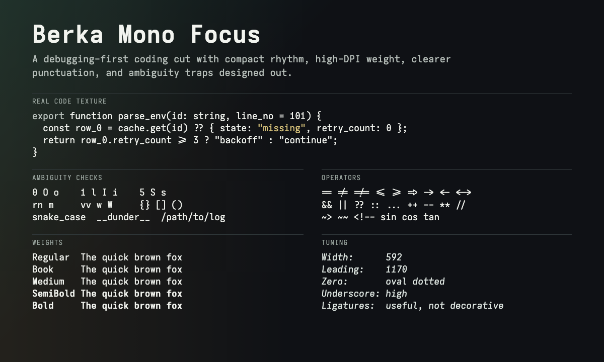
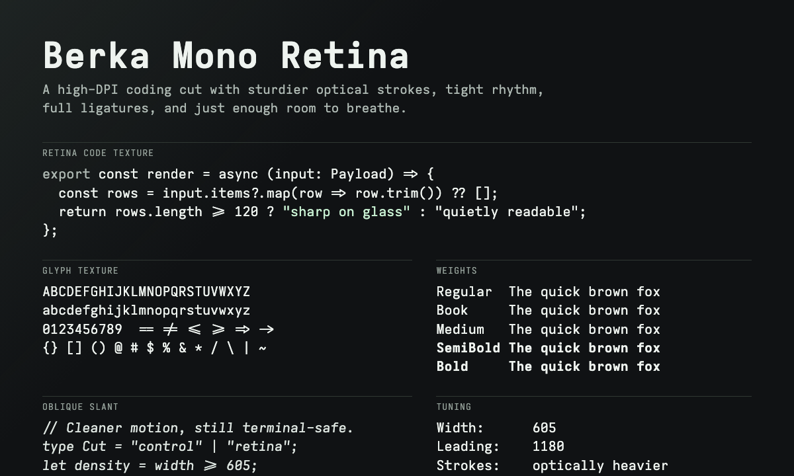
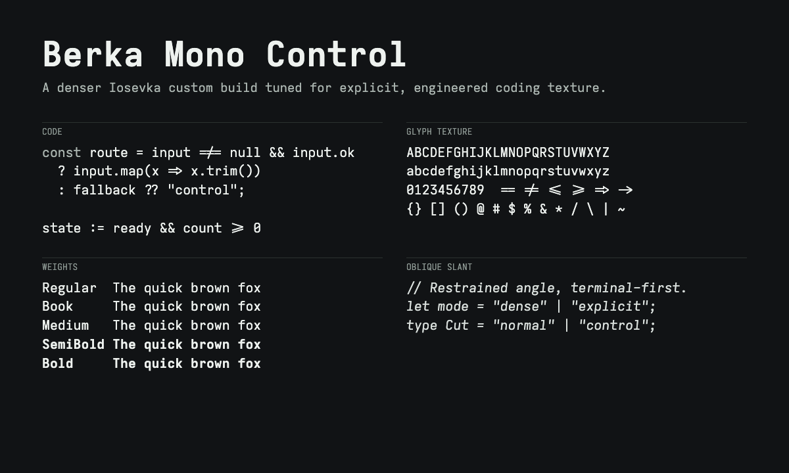
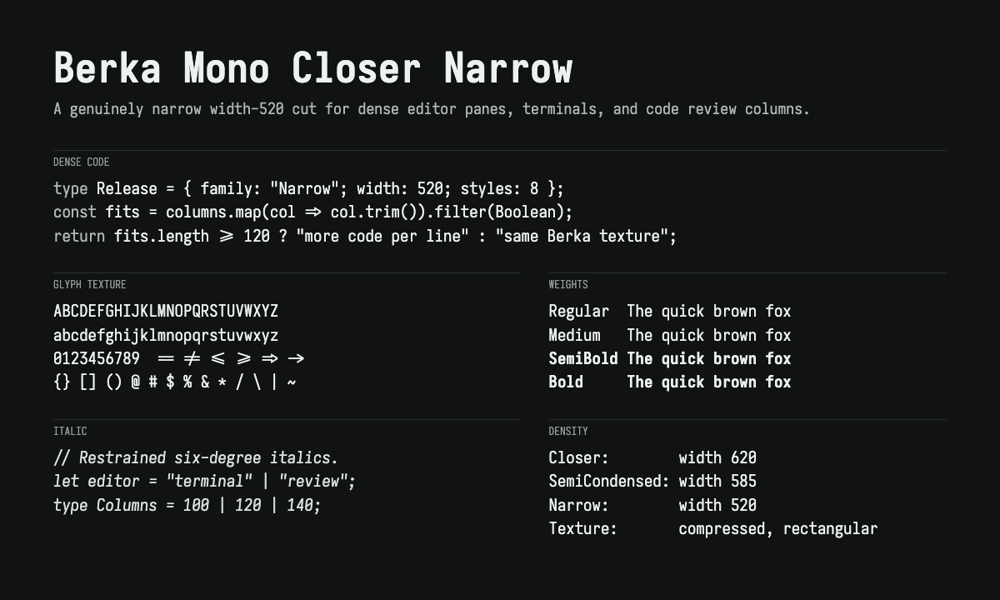
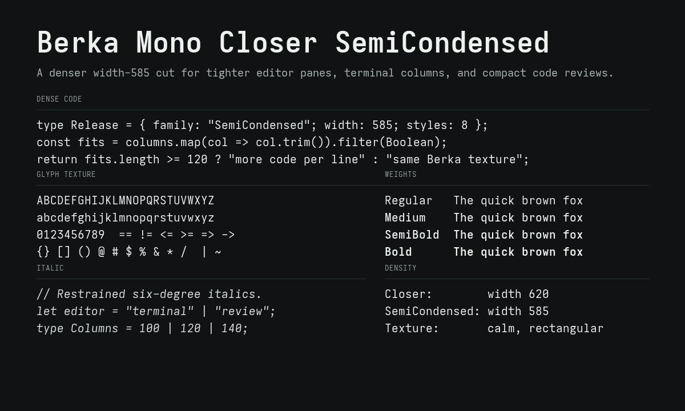
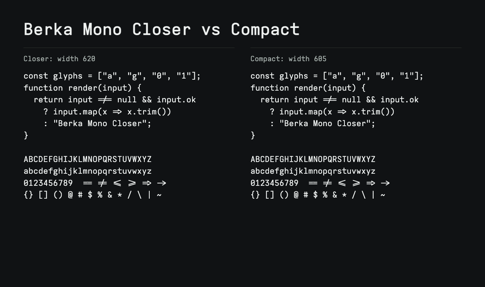
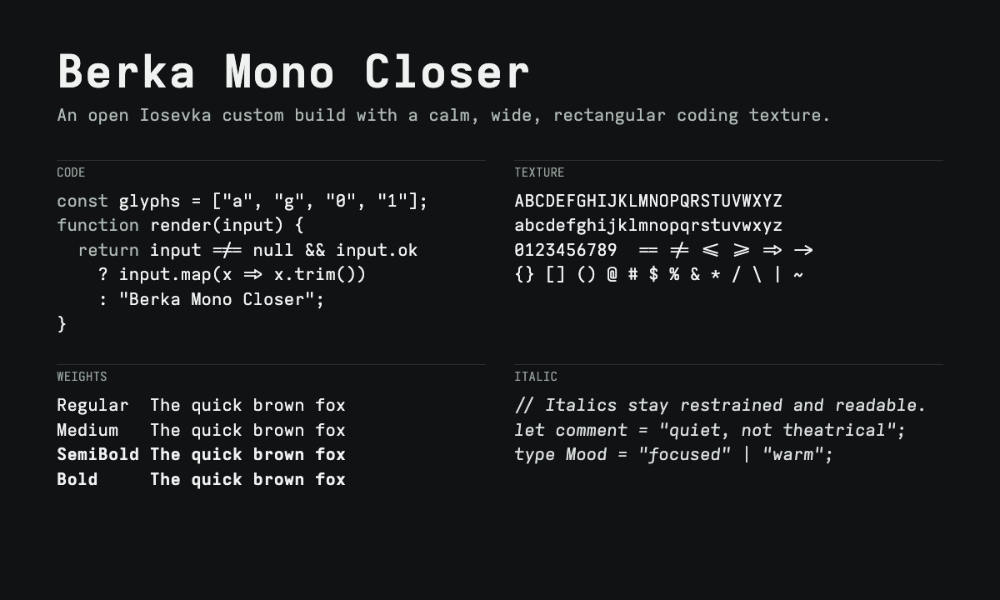
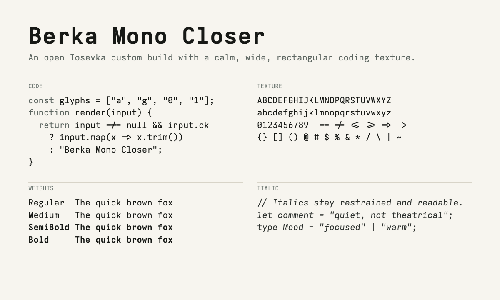

# Berka Mono Closer

Berka Mono Closer is a family of custom [Iosevka](https://github.com/be5invis/Iosevka) builds tuned for calm, rectangular, readable coding text.

## Install

Recommended everyday setup:

```sh
curl -fsSL https://raw.githubusercontent.com/vinitkumar/berka-mono-closer/main/scripts/install.sh | sh -s -- focus
```

Interactive setup:

```sh
curl -fsSL https://raw.githubusercontent.com/vinitkumar/berka-mono-closer/main/scripts/install.sh | sh
```

The installer downloads all required TTF files for the selected family, installs
them, and configures supported editors/terminals when their config files are
present.

Supported app setup:

```text
VS Code, Cursor, Windsurf, JetBrains IDEs, Zed, Ghostty, Kitty, Alacritty,
Windows Terminal, GNOME Terminal, Neovim, Vim, MacVim, Neovide, and Xcode.
```

## Pick A Family

| Choice | Family name | Best for |
| --- | --- | --- |
| `focus` | `Berka Mono Focus` | Recommended default. Debugging-first, clearer ambiguity cases, compact rhythm. |
| `retina` | `Berka Mono Retina` | High-DPI screens where you want heavier optical strokes and full ligatures. |
| `control` | `Berka Mono Control` | Terminal-first compact feel with full Iosevka `default-calt`. |
| `closer` | `Berka Mono Closer` | Wider, calm original cut. |
| `compact` | `Berka Mono Closer Compact` | Slightly denser original cut. |
| `semi-condensed` | `Berka Mono Closer SemiCondensed` | More columns without going narrow. |
| `narrow` | `Berka Mono Closer Narrow` | Maximum terminal/editor density. |

Use a different family by changing the final argument:

```sh
curl -fsSL https://raw.githubusercontent.com/vinitkumar/berka-mono-closer/main/scripts/install.sh | sh -s -- retina
```

Try the fonts in the browser: <https://vinitkumar.github.io/berka-mono-closer/>

## Manual Setup

Download the latest release: <https://github.com/vinitkumar/berka-mono-closer/releases/latest>

Install the TTF files from:

```text
fonts/ttf/
fonts/ttf-compact/
fonts/ttf-semi-condensed/
fonts/ttf-narrow/
fonts/ttf-control/
fonts/ttf-retina/
fonts/ttf-focus/
```

Use the WOFF2 files for websites:

```text
fonts/woff2/
fonts/woff2-compact/
fonts/woff2-semi-condensed/
fonts/woff2-narrow/
fonts/woff2-control/
fonts/woff2-retina/
fonts/woff2-focus/
```

On macOS, you can copy them into `~/Library/Fonts` manually:

```sh
./scripts/install-macos.sh
```

Use one of these family names in editors and terminals:

```text
Berka Mono Closer
Berka Mono Closer Compact
Berka Mono Closer SemiCondensed
Berka Mono Closer Narrow
Berka Mono Control
Berka Mono Retina
Berka Mono Focus
```

## Editor Setup

VS Code, Cursor, and Windsurf:

```json
{
  "editor.fontFamily": "'Berka Mono Focus', Menlo, Monaco, monospace",
  "editor.fontLigatures": true,
  "terminal.integrated.fontFamily": "Berka Mono Focus"
}
```

Zed:

```json
{
  "buffer_font_family": "Berka Mono Focus",
  "buffer_font_features": {
    "calt": true,
    "liga": true
  },
  "terminal": {
    "font_family": "Berka Mono Focus"
  }
}
```

Ghostty:

```conf
font-family = "Berka Mono Focus"
font-family-bold = "Berka Mono Focus"
font-family-italic = "Berka Mono Focus"
font-family-bold-italic = "Berka Mono Focus"
font-size = 15
font-feature = liga
font-feature = calt
font-feature = clig
font-thicken = true
```

Kitty:

```conf
font_family      family="Berka Mono Focus"
bold_font        family="Berka Mono Focus" style="Bold"
italic_font      family="Berka Mono Focus" style="Italic"
bold_italic_font family="Berka Mono Focus" style="Bold Italic"
font_size        15.0
disable_ligatures never
```

For another family, replace `Berka Mono Focus` with the matching family name
from the table above. Full terminal examples are in:

```text
examples/ghostty.conf
examples/kitty.conf
```

## Website Fonts

Use WOFF2 files for websites. Example:

```css
@font-face {
  font-family: "Berka Mono Focus";
  src: url("fonts/woff2-focus/BerkaMonoFocus-Regular.woff2") format("woff2");
  font-weight: 400;
  font-style: normal;
  font-display: swap;
}
```

## Families

The families share the same core upright glyph design. The real differences are
width, weight, leading, italic construction, and ligature policy:

| Family | Cell width | Weights | Leading | Italic | Ligature policy |
| --- | ---: | --- | ---: | --- | --- |
| `Berka Mono Closer` | 620 | 400, 500, 600, 700 | 1200 | italic | disables `arrow-wave`, `counter-arrow-wave`, `html-comment`, `trig` |
| `Berka Mono Closer Compact` | 605 | 400, 500, 600, 700 | 1200 | italic | same disables as Closer |
| `Berka Mono Closer SemiCondensed` | 585 | 400, 500, 600, 700 | 1200 | italic | same disables as Closer |
| `Berka Mono Closer Narrow` | 520 | 400, 500, 600, 700 | 1180 | italic | same disables as Closer |
| `Berka Mono Control` | 595 | 400, 450, 500, 600, 700 | 1180 | oblique | full Iosevka `default-calt` |
| `Berka Mono Retina` | 605 | 430, 470, 530, 630, 730 | 1180 | oblique | full Iosevka `default-calt` |
| `Berka Mono Focus` | 592 | 425, 465, 525, 620, 710 | 1170 | oblique | debugging-first `default-calt` subset |

All families include Regular, Italic, Medium, Medium Italic, SemiBold,
SemiBold Italic, Bold, and Bold Italic. Control, Retina, and Focus also include
Book and Book Italic.

Focus is the recommended everyday coding cut. It keeps useful operator
ligatures but disables decorative wave arrows, HTML comment ligatures, trig
ligatures, and tilde chaining so raw source stays easy to inspect. It also uses
a dotted zero, a flat-top `1`, a high underscore for `snake_case`, larger
parentheses, and curly-flat braces for nested code.

## Ligatures

Programming ligatures are enabled through Iosevka's `default-calt` set.

Closer, Compact, SemiCondensed, and Narrow intentionally disable a few more decorative groups:

- `arrow-wave`
- `counter-arrow-wave`
- `html-comment`
- `trig`

Control and Retina keep the full `default-calt` set for broader language and
markup coverage.

## Specimen Gallery

<table>
  <tr>
    <td><br><strong>Focus</strong></td>
    <td><br><strong>Retina</strong></td>
  </tr>
  <tr>
    <td><br><strong>Control</strong></td>
    <td><br><strong>Narrow</strong></td>
  </tr>
  <tr>
    <td><br><strong>SemiCondensed</strong></td>
    <td><br><strong>Compact</strong></td>
  </tr>
</table>

<details>
  <summary>Original Closer specimens</summary>
  <p></p>
  <p></p>
</details>

## Build From Source

Requirements:

- Node.js 16 or newer
- npm
- `ttfautohint`
- Python 3 with `fonttools` for WOFF2 generation
- git

On macOS:

```sh
brew install ttfautohint
```

Build:

```sh
git clone --depth 1 https://github.com/be5invis/Iosevka.git
cd Iosevka
cp /path/to/berka-mono-closer/sources/private-build-plans.toml ./private-build-plans.toml
npm install
npm run build -- ttf::BerkaMonoCloser --jCmd=2
cp /path/to/berka-mono-closer/sources/compact/private-build-plans.toml ./private-build-plans.toml
npm run build -- ttf::BerkaMonoCloserCompact --jCmd=2
cp /path/to/berka-mono-closer/sources/semi-condensed/private-build-plans.toml ./private-build-plans.toml
npm run build -- ttf::BerkaMonoCloserSemiCondensed --jCmd=2
cp /path/to/berka-mono-closer/sources/narrow/private-build-plans.toml ./private-build-plans.toml
npm run build -- ttf::BerkaMonoCloserNarrow --jCmd=2
cp /path/to/berka-mono-closer/sources/control/private-build-plans.toml ./private-build-plans.toml
npm run build -- ttf::BerkaMonoControl --jCmd=2
cp /path/to/berka-mono-closer/sources/retina/private-build-plans.toml ./private-build-plans.toml
npm run build -- ttf::BerkaMonoRetina --jCmd=2
cp /path/to/berka-mono-closer/sources/focus/private-build-plans.toml ./private-build-plans.toml
npm run build -- ttf::BerkaMonoFocus --jCmd=2
```

The generated files will be in:

```text
dist/BerkaMonoCloser/TTF/
dist/BerkaMonoCloserCompact/TTF/
dist/BerkaMonoCloserSemiCondensed/TTF/
dist/BerkaMonoCloserNarrow/TTF/
dist/BerkaMonoControl/TTF/
dist/BerkaMonoRetina/TTF/
dist/BerkaMonoFocus/TTF/
```

You can also run:

```sh
./scripts/build.sh /path/to/Iosevka
```

The script copies each family-specific build plan before building that family, including `sources/narrow/private-build-plans.toml` for `Berka Mono Closer Narrow`, `sources/retina/private-build-plans.toml` for `Berka Mono Retina`, and `sources/focus/private-build-plans.toml` for `Berka Mono Focus`.

Generate WOFF2 files from the checked-in TTF files:

```sh
./scripts/build-woff2.sh
```

## Legal Notes

Berka Mono Closer is a modified build of Iosevka and is distributed under the SIL Open Font License 1.1, matching Iosevka's license.

What makes this legal:

- The source is Iosevka, an OFL-licensed font project.
- The font is generated from Iosevka's documented custom build configuration.
- The name is changed to `Berka Mono Closer`, so it does not use Iosevka's reserved font name as the primary family name.
- No commercial font software, outlines, metrics files, or binaries are included.
- The design goal is a general visual direction: calm, wide, rectangular, readable coding text. It is not a clone of any proprietary font.
- The Control variant is guided by public high-level design language from a datasheet, but it is generated only from Iosevka source and documented custom-build parameters.
- The Focus variant is an original coding-readability tuning built from Iosevka parameters for ambiguity reduction, compact scan density, and restrained ligatures.

This project is not affiliated with, endorsed by, or derived from Berkeley Mono or US Graphics Company. Berkeley Mono is a separate commercial font.

## License

Licensed under the SIL Open Font License 1.1. See [LICENSE](LICENSE).
