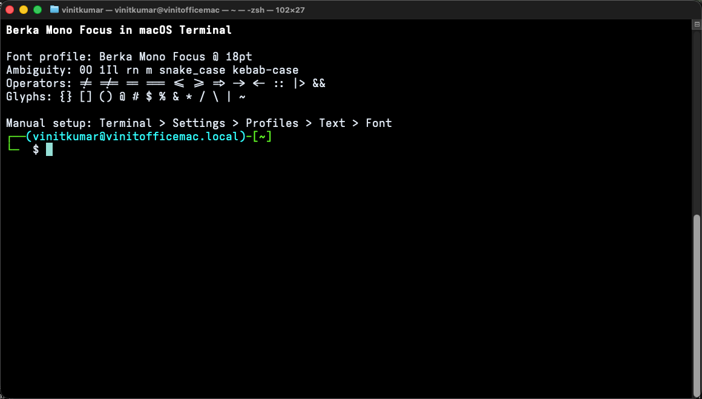

# Mac Terminal Setup

Terminal.app does not have a plain-text config file for fonts. Configure Berka
Mono from Terminal's profile settings UI.

## Screenshot

This screenshot was captured from macOS Terminal using a dedicated `Berka Mono
Focus` profile at 18pt.



## Steps

1. Install a Berka font family first:

   ```sh
   curl -fsSL https://raw.githubusercontent.com/vinitkumar/berka-mono-closer/main/scripts/install.sh | sh -s -- focus
   ```

2. Open Terminal.

3. Go to:

   ```text
   Terminal -> Settings -> Profiles
   ```

4. Select the profile you use, or click `+` to create a dedicated profile such
   as `Berka Mono Focus`.

5. Open the `Text` tab.

6. In the `Font` row, click `Change...`.

7. Pick the installed family, for example:

   ```text
   Berka Mono Focus
   ```

8. Set the size. `18pt` is a good starting point for Retina displays.

9. Close the font picker and open a new Terminal window with that profile.

## Optional AppleScript

Terminal profiles can also be changed with AppleScript. This creates or updates
a dedicated profile without changing your existing default profile:

```sh
osascript <<'APPLESCRIPT'
tell application "Terminal"
  if not (exists settings set "Berka Mono Focus") then
    set berkaProfile to (make new settings set with properties {name:"Berka Mono Focus"})
  else
    set berkaProfile to settings set "Berka Mono Focus"
  end if

  set font name of berkaProfile to "Berka Mono Focus"
  set font size of berkaProfile to 18
end tell
APPLESCRIPT
```

If you want this to become the default for new Terminal windows, open:

```text
Terminal -> Settings -> Profiles
```

Then select the profile and click `Default`.
